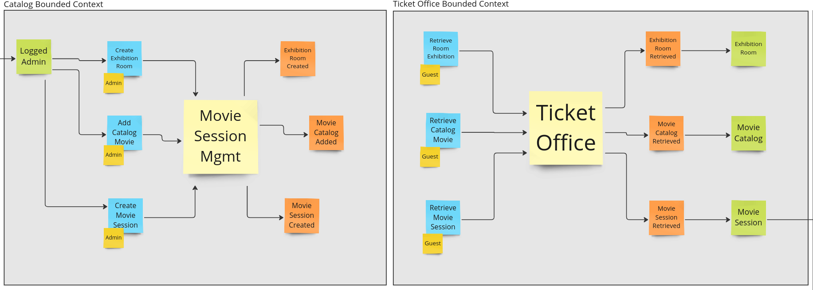
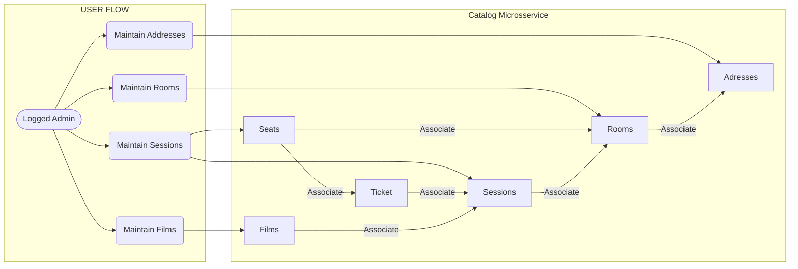
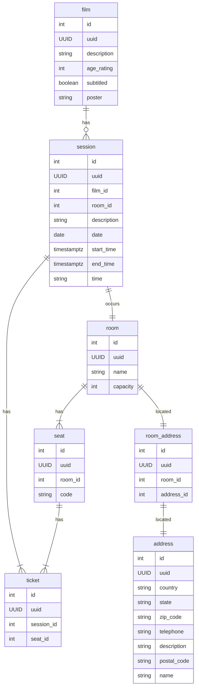

<a id="cine-catalog"></a>
###  :cinema: Go Catalog API for CineTicket pet-project :ticket:

<!-- 
    Logo image generated by Bing IA: https://www.bing.com/images/create/
-->


<!-- 
    icons by: https://simpleicons.org
-->
[](https://go.dev/) [](https://www.docker.com/) []() [](https://github.com/jtonynet) [](https://miro.com/)  [](https://code.visualstudio.com/) [](https://blog.postman.com/introducing-the-postman-vs-code-extension/)  [](https://www.postgresql.org/) [](https://redis.io/) [](https://swagger.io/) [](https://gatling.io/)  [](https://gatling.io/) 


 __This is an initial readme, here you can find the project's goals, and some features are not yet fully available. *__ 

---


<a id="index"></a>
## :arrow_heading_up: index
<!--ts-->

- [CineCatalog Microsservice](#cine-catalog)
  :arrow_heading_up: [index](#arrow_heading_up-index)
  :green_book: [About](#about)
  :umbrella: [Event Storming](#event-storming)
  :computer: [Run the project](#run)
  :bar_chart: [Diagrams](#diagrams)
  :newspaper: [API Documentation](#api-docs)
  :toolbox: [Tools](#tools)
  :clap: [Best Practices](#best-practices)
  :brain: [ADR - Architecture Decision Records](#adr)
  :1234: [Versions](#versions)


[:arrow_heading_up: back to top](#index)


---

<a id="about"></a>
## :green_book: About:

This project aims to address the needs of cataloging cinema halls, movies, and sessions on a cinema ticket e-commerce website. It is part of a broader study of the mentioned e-commerce. However, its responsibility as microservices is to register, maintain, and provide session and seat data.

This is a Golang version of the mentioned service. Swagger Docs, Flow Diagrams, Entity-Relationship Diagrams (DER), and Event Storming provide more context to the service's scenario.

The objective of this system is to maintain a [high level of maturity](https://martinfowler.com/articles/richardsonMaturityModel.html) with a consistent RESTful API, along with the possibility of caching and a robust logging system.


[:arrow_heading_up: back to top](#index)

---

<a id="event-storming"></a>
## :umbrella: Event Storming Diagram:

In November 2023, I received assistance from other developers in modeling the events of this project and other parts of 'cine-ticket.' We conducted an extensive remote Event Storming session with the aim of mapping events, commands, aggregates, and their relationships.

The diagram below is a product of this study and is being used as a guide for the development of this API and others that will be part of 'CineTicket.'

At the moment, we are abstracting the authentication flow and the ticket purchase flow.



<br/><br/>

[:arrow_heading_up: back to top](#index)

---
<a id="run"></a>
## :computer: Run the project

Create a copy of the 'sample.env' file with the name '.env' and run the 'docker compose up' command (according to your 'docker compose' version) in the project's root directory:
```bash
$ docker compose up
```

> :writing_hand: **Note**:
>
> :window: Troubleshooting with [Windows](https://stackoverflow.com/questions/53165471/building-docker-images-on-windows-entrypoint-script-no-such-file-or-directory)
> Git attribute settings that might affect the line ending character are not working as expected. To run the project on Windows, you will need to make changes to the './tests/gatling/entrypoint.sh' file. Convert the file from 'LF' to 'CRLF' in your preferred text editor.

<br/>

[:arrow_heading_up: back to top](#index)

---

<a id="diagrams"></a>
## :bar_chart: System Diagrams:

**Flow Diagram:**


<br/><br/>

**DER:**



[:arrow_heading_up: back to top](#index)

---
<a id="api-docs"></a>
## :newspaper: API Documentation

####   Generate Swagger docs:

With the 'cine-catalog' image running, type:

```bash
$ docker exec -ti cine-catalogue swag init --parseDependency --parseInternal  --generalInfo cmd/api/main.go
```

[:arrow_heading_up: back to top](#index)

---
<a id="tools"></a>
## :toolbox: Tools

- Language:
  - [Go v1.21.1](https://go.dev/)
  - [GVM v1.0.22](https://github.com/moovweb/gvm)

- Framework & Libs:
  - [Gin](https://gin-gonic.com/)
  - [GORM](https://gorm.io/index.html)
  - [Viper](https://github.com/spf13/viper)
  - [Gin-Swagger](https://github.com/swaggo/gin-swagger)
<!--
  - [gin-contrib/pprof](https://github.com/gin-contrib/pprof)
  - [Exponential Backoff](https://github.com/cenkalti/backoff)
  - [go-redis](https://github.com/redis/go-redis)
  - [amqp091-go](https://github.com/rabbitmq/amqp091-go) 
-->
  - [gjson](https://github.com/tidwall/gjson)
  - [uuid](github.com/google/uuid)

- Infra & Technologies
  - [Docker v24.0.6](https://www.docker.com/)
  - [Docker compose v2.21.0](https://www.docker.com/)
  - [Postgres v16.0](https://www.postgresql.org/)
  - [Redis 6.2](https://redis.io/)
<!--
  - [RabbitMQ v3.12.6](https://www.rabbitmq.com/)
-->
  - [Gatling v3.9.5](https://gatling.io/)


- GUIs:
  - [VsCode](https://code.visualstudio.com/)
  - [Postman](https://blog.postman.com/introducing-the-postman-vs-code-extension/)
  - [DBeaver](https://dbeaver.io/)
  - [another-redis-desktop-manager](https://github.com/qishibo/AnotherRedisDesktopManager)


[:arrow_heading_up: voltar](#indice)

---

<a id="best-practices"></a>
## :clap: Best Practices

- [Conventional Commits](https://www.conventionalcommits.org/en/v1.0.0/)
- [keep a changelog](https://keepachangelog.com/en/1.0.0/)
- [Event Storming](https://en.wikipedia.org/wiki/Event_storming)
- [Miro Diagrams](https://miro.com/)
- [Mermaid Diagrams](https://mermaid.js.org)
- [Swagger](https://swagger.io/)
- [High Rest Maturity Model](https://martinfowler.com/articles/richardsonMaturityModel.html)

<!-- 
- [Load testing](https://en.wikipedia.org/wiki/Load_testing)
- [Go pprof](https://go.dev/blog/pprof)
-->

[:arrow_heading_up: back to top](#index)

---

<a id="adr"></a>
## :brain: ADR - Architecture Decision Records:

- [0001: Record architecture decisions](./misc/architecture/decisions/0001-record-architecture-decisions.md)

[:arrow_heading_up: back to top](#index)

---
<a id="adr"></a>
## :1234: Versions:

Version tags are being created manually as studies progress with notable improvements in the project. Each feature is developed on a separate branch, and when completed, a tag is generated and merged into the master branch.

For more information, please refer to the [Version History](./CHANGELOG.md)

[:arrow_heading_up: back to top](#index)