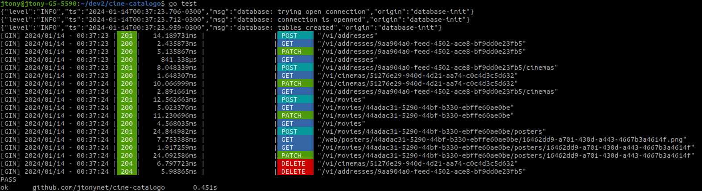
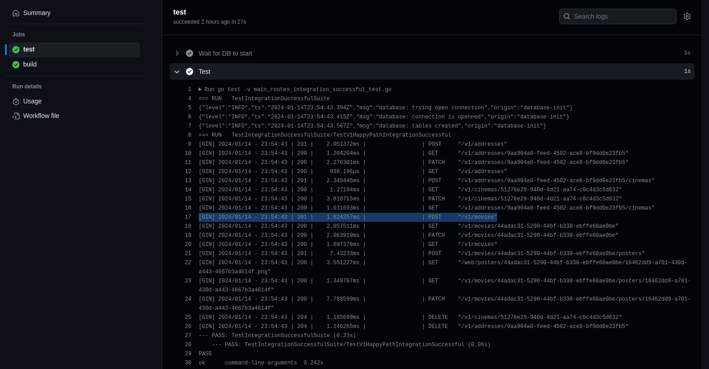
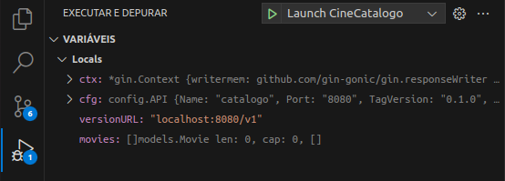
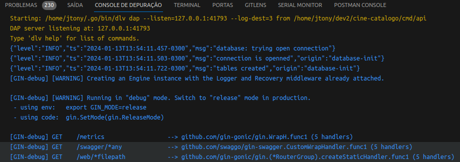
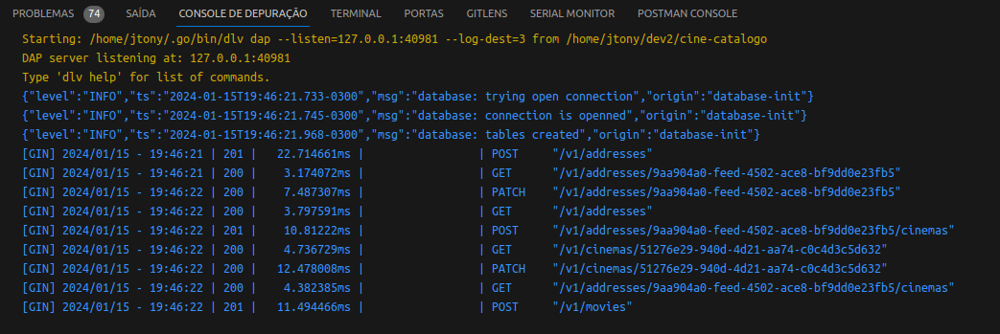
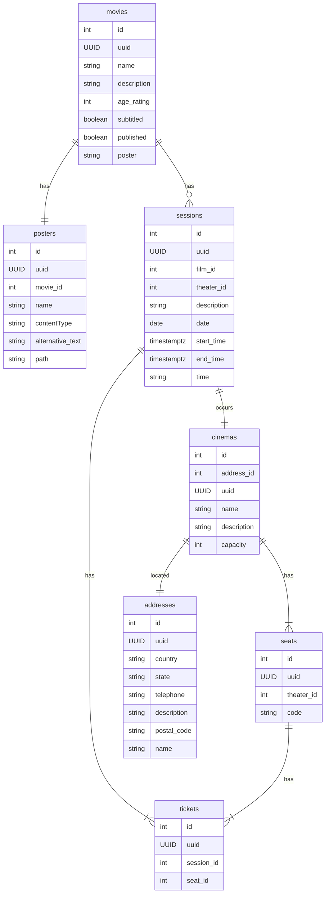
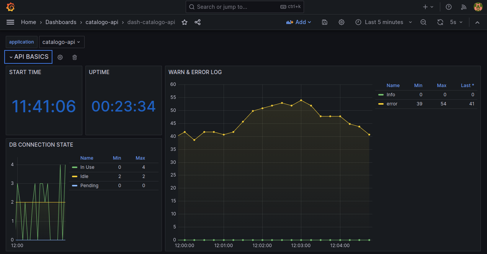
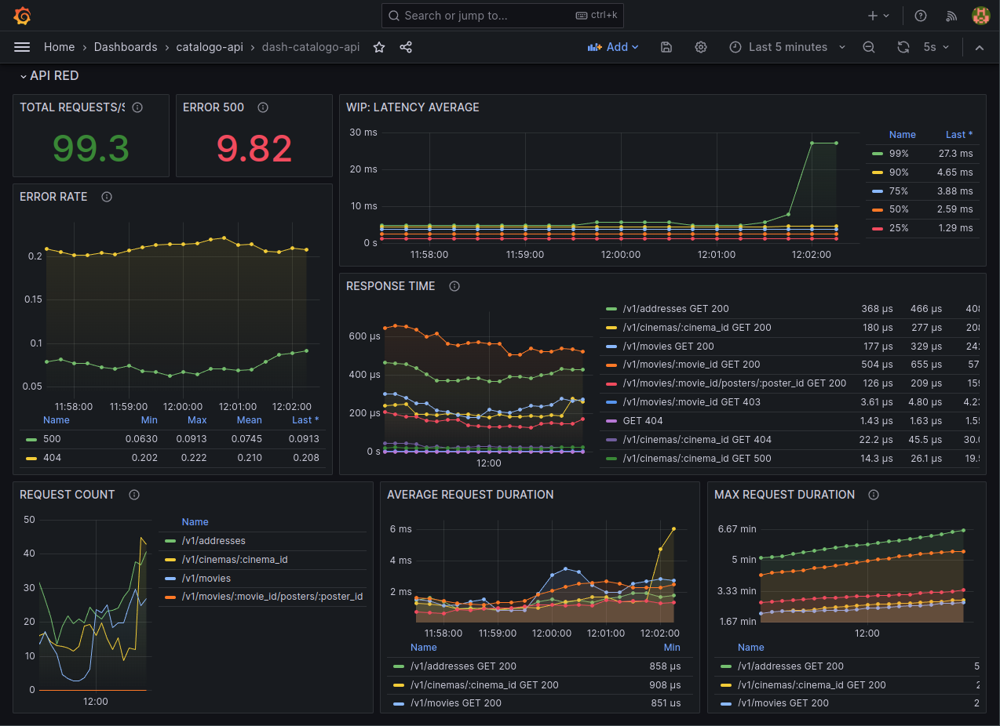
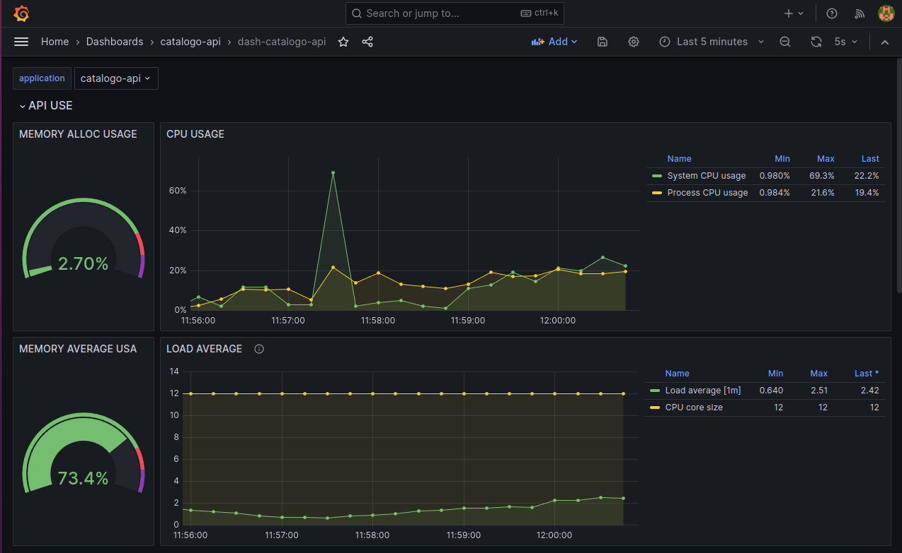
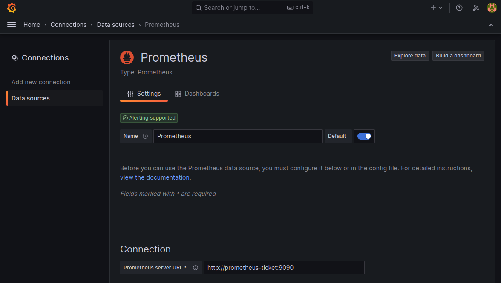

<a id="cine-catalogo"></a>
<!-- 
    Logo image generated by Bing IA: https://www.bing.com/images/create/
-->


<!-- 
    icons by: https://simpleicons.org
-->
[](https://go.dev/) [](https://www.docker.com/) [](https://ubuntu.com/) [](https://github.com/spf13/viper) [](https://github.com/jtonynet) [](https://miro.com/) [](https://mermaid.js.org/) [](https://code.visualstudio.com/) [](https://en.wikipedia.org/wiki/Hypertext_Application_Language) [](https://blog.postman.com/introducing-the-postman-vs-code-extension/) [](https://www.postgresql.org/)  [](https://swagger.io/) [](https://prometheus.io/) [](https://grafana.com/) [](https://docs.github.com/en/actions) 

<!--
[](https://www.jaegertracing.io/) [](https://www.jaegertracing.io/) [](https://redis.io/) [](https://www.keycloak.org/) [](https://gatling.io/) [](https://gatling.io/) [](https://ceph.io/en/) 
-->

 

 [](https://miro.com/app/board/uXjVNRofMoA=/) [](https://www.youtube.com/watch?v=6nEbm71Vc3w) [](https://github.com/users/jtonynet/projects/2)

 __This is an initial readme, here you can find the project's goals, and some features are not yet fully available. *__ 

<br/>

---

#### 🕸️ Found me in web:
[](https://www.linkedin.com/in/jos%C3%A9-r-99896a39/) [](https://dev.to/learningenuity) [](mailto:learningenuity@gmail.com) [](https://twitter.com/aromademirtilo) [](https://www.instagram.com/learningenuity) 

---

<a id="index"></a>
## :arrow_heading_up: index

[CineCatalogo Microsservice](#cine-catalogo)<br/>
  1. :arrow_heading_up: [index](#arrow_heading_up-index)
  2. :green_book: [About](#about)
  3. :computer: [Run the project](#run)
  4. :newspaper: [API Documentation](#api-docs)
  5. :white_check_mark: [Tests](#tests)
  6. :beetle: [Debug](#debug)
  7. :umbrella: [Event Storming](#event-storming)
  8. :bar_chart: [Diagrams](#diagrams)
  9. :traffic_light: [HATEOAS HAL](#HATEOAS)
  10. :detective: [Observability](#observability)
  11. :toolbox: [Tools](#tools)
  12. :clap: [Best Practices](#best-practices)
  13. :brain: [ADR - Architecture Decision Records](#adr)
  14. :1234: [Versions](#versions)
  15. :robot: [Use of AI](#ia)

<br/>

[:arrow_heading_up: back to top](#index)

---

<a id="about"></a>
## 📗 About:

This project aims to address the needs of cataloging cinema halls, movies, and sessions on a cinema ticket e-commerce website. It is part of a broader study of the mentioned e-commerce called [CineTicket](https://github.com/jtonynet/cine-ticket-study-microsservices). However, its responsibility as microservices is to register, maintain, and provide session and seat data.

This is a Golang version of the mentioned service. Swagger Docs, Flow Diagrams, Entity-Relationship Diagrams (DER), and Event Storming provide more context to the service's scenario.

The objective of this system is to maintain a [high level of maturity](https://martinfowler.com/articles/richardsonMaturityModel.html) with a consistent RESTful API, along with the possibility of caching and a robust logging system.


In the current branch, you will find the "happy path" for creating addresses, cinema rooms, movies, and posters. Log handling, observability, and testing will be developed in future branches.

<br/>

[:arrow_heading_up: back to top](#index)

---

<a id="run"></a>
## 💻 Run the project

Create a copy of the 'SAMPLE.env' file with the name '.env' and run the 'docker compose up' command (according to your 'docker compose' version) in the project's root directory:
```bash
$ docker compose up
```

> :writing_hand: **Note**:
>
> __Troubleshooting with [Docker Volumes](https://betterstack.com/community/questions/what-is-the-best-way-to-manage-permissions-for-docker-shared-volumes/)__
> For the purpose of setting up the local environment, one might encounter issues with permissions in the docker_data folder, which stores the volumes of the components needed to run the environment. The docker-compose creates this folder but does not grant it the necessary permissions to manage these volumes. The approach we are currently using to handle this is to run the following command in case you encounter an error on the first attempt of `docker compose up`:
>```bash
>sudo chmod -R 777 docker_data/
>``` 

> :writing_hand: **Note**:
>
> __Troubleshoting:__ Error response from daemon: listen tcp4 0.0.0.0:5432: bind: address already in use
>It's not uncommon, while running tests and other applications concurrently with Postgres, to encounter a port collision caused by the container/image. You should stop the relevant container, and if the issue persists, use the following commands:
>```bash
>sudo lsof -i -P -n | grep 5432
>sudo kill -9 <process id>
>```
>as seen in this [Stack Overflow](https://stackoverflow.com/questions/46176584/docker-bind-for-0-0-0-04000-failed-port-is-already-allocated) question with other possible solutions.


<br/>

[:arrow_heading_up: back to top](#index)

---
<a id="api-docs"></a>
## 📰  API Documentation

####   Swagger docs:

Below is a screenshot of the latest documentation, which can be accessed here on http://localhost:8080/swagger/index.html with the project running locally. For now, only the happy path is functional; new iterations will add observability, testing, and other components.


<br/>

__Generate Docs:__
With the 'cine-catalogo' image running, type:

```bash
$ docker exec -ti cine-catalogo swag init --generalInfo cmd/api/main.go --exclude ./web,./tools
```

<br/>

[:arrow_heading_up: back to top](#index)

---

<a id="tests"></a>
### :white_check_mark: Tests

In the project root directory, and without running all Docker Compose dependencies, execute the following commands:

```bash
$ docker compose up postgres-catalogo -d
$ go test -v
```

The Output:


This project is a simple CRUD with a two-tier architecture. Unit tests don't make sense in this scenario. An integration test is the best approach. At the moment, only the "happy path" for success is covered. I plan to increase the test coverage in the future to include corner cases.

> :writing_hand: **Note**:
>
>It is necessary to have Go 1.21.1 or GVM with this version installed on the machine because tests runs locally.
>

Integration tests running on github action:


<br/>

[:arrow_heading_up: back to top](#index)

---

<a id="debug"></a>
### :beetle: Debug
Using VSCode as a code editor with the following configuration in the `.vscode/launch.json` file:

```json
{
    "version": "0.2.0",
    "configurations": [
        {
            "name": "Launch CineCatalogo",
            "type": "go",
            "request": "launch",
            "mode": "debug",
            "program": "${workspaceFolder}/cmd/api/main.go",
            "cwd": "${workspaceFolder}",
            "trace": "verbose",
        },
        {
            "name": "Test CineCatalogo",
            "type": "go",
            "request": "launch",
            "mode": "test",
            "program":"${workspaceFolder}/main_routes_integration_successful_test.go",
            "trace": "verbose",
        }
    ]
}
```

Alter the `.env` configuration for `DATABASE_HOST` and `API_HOST` to `localhost` and `localhost:8080` respectively to enable local debugging.

```env
...
API_HOST=localhost:8080          # catalogo-api | localhost:8080
...
DATABASE_HOST=localhost          # postgres-catalogo | localhost
```


In the project root directory, and without running all Docker Compose dependencies, execute the following commands:
```bash
$ docker compose up postgres-catalogo -d
```

Distribute breakpoints at code points of interest, and in `Run and Debug` click on `Launch Cinecatalogo`. Access the API via the browser to initiate your debugging process.





<br/>
<br/>

To run debugging on test routines, select and click on the "Test CineCatalogo" option in `Run and Debug`. To enable debugging in test mode, no changes are required in the `.env` file, as these environment variable values are initialized within the test suite itself.




See [VisualStudio Go Debugging](https://code.visualstudio.com/docs/languages/go#_debugging) for more configuration details

> :writing_hand: **Notes**:
>
> - It is necessary to have Go 1.21.1 or GVM with this version installed on the machine because debugging runs locally.
> - Revert `.env` to its original values to execute `docker compose up` and restore the correct system behavior.
>

<br/>

[:arrow_heading_up: back to top](#index)

---

<a id="event-storming"></a>
## ☔ Event Storming Diagram:

In November 2023, we conducted event modeling for this project and other parts of CineTicket (Thanx for the help, [marciovmartins](https://github.com/marciovmartins)). We held an extensive remote Event Storming session with the goal of mapping events, commands, aggregates, and their relationships.

You can follow part of our findings on [YouTube](https://www.youtube.com/watch?v=6nEbm71Vc3w) in PT-BR.


At the moment, we are abstracting the authentication flow and the ticket purchase flow.


<br/>

[:arrow_heading_up: back to top](#index)

---

<a id="diagrams"></a>
## 📊 System Diagrams:

**Flow Diagram:**


<br/><br/>

**DER:**



<br/>

[:arrow_heading_up: back to top](#index)


---

<a id="HATEOAS"></a>
### 🚥 HATEOAS HAL

The API is being developed following RESTful guidelines at `maturity level 4` for educational purposes. Hal Explores can be used to navigate and validate consistency with the specification by simply accessing a [local tests URL](http://localhost:4200/#uri=http://localhost:8080/v1/) with the application running. See the [Hypertext Application Language](https://en.wikipedia.org/wiki/Hypertext_Application_Language) for more details .


<br/>

[:arrow_heading_up: back to top](#index)

---

<a id="observability"></a>
## 🕵️ Observability:

Local URLs:
- Grafana - http://localhost:3000/ (user/pwd: admin - admin | admin - 12345)
- Prometheus - http://localhost:9090/



<br/>



<br/>




The volume data is not shared in this repository. To use the 'catalogo-api' project dashboard, it will be necessary create a [Datasource](http://localhost:3000/connections/datasources) aiming your prometheus URL http://prometheus-ticket:9090 and [import the corresponding JSON](https://grafana.com/docs/grafana/latest/dashboards/manage-dashboards/#import-a-dashboard) on `scripts/grafana-dashboards/dash-catalogo-api.json` into your local Grafana after the proper installation of the project.




The JSON file is located in [scripts/grafana-dashboards](./scripts/grafana-dashboards)

[:arrow_heading_up: back to top](#index)

---

<a id="tools"></a>
## 🧰 Tools

- Language:
  - [Go v1.21.1](https://go.dev/)
  - [GVM v1.0.22](https://github.com/moovweb/gvm)

- Framework & Libs:
  - [Gin](https://gin-gonic.com/)
  - [Testify](github.com/stretchr/testify)
  - [Gopsutil]("github.com/shirou/gopsutil)
  - [Client-prometheus](https://github.com/prometheus/client_golang)
  - [Go opentelemetry](https://github.com/open-telemetry/opentelemetry-go-contrib)
  - [GORM](https://gorm.io/index.html)
  - [GORM Prometheus](https://github.com/go-gorm/prometheus)
  - [Viper](https://github.com/spf13/viper)
  - [Gin-Swagger](https://github.com/swaggo/gin-swagger)
  - [Gjson](https://github.com/tidwall/gjson)
  - [uuid](https://github.com/google/uuid)
  - [Go2hall](https://github.com/pmoule/go2hall)
  - [Zap log](https://github.com/uber-go/zap)
  - [Delve](https://github.com/go-delve/delve)

- Infra & Technologies
  - [Docker v24.0.6](https://www.docker.com/)
  - [Docker compose v2.21.0](https://www.docker.com/)
  - [Postgres v16.0](https://www.postgresql.org/)
  - [Prometheus](https://prometheus.io/docs/guides/go-application)
  - [Grafana](https://grafana.com/)

<!--
  - [Redis 6.2](https://redis.io/)
  - [Gatling v3.9.5](https://gatling.io/)
-->

- GUIs:
  - [VsCode](https://code.visualstudio.com/)
  - [Postman](https://blog.postman.com/introducing-the-postman-vs-code-extension/)
  - [DBeaver](https://dbeaver.io/)
  - [Another Redis Desktop Manager](https://github.com/qishibo/AnotherRedisDesktopManager)


<br/>

[:arrow_heading_up: back to top](#index)

---

<a id="best-practices"></a>
## 👏 Best Practices

- [Conventional Commits](https://www.conventionalcommits.org/en/v1.0.0/)
- [Keep a Changelog](https://keepachangelog.com/en/1.0.0/)
- [ADR - Architecture Decision Records](https://cognitect.com/blog/2011/11/15/documenting-architecture-decisions)
- [Event Storming](https://en.wikipedia.org/wiki/Event_storming)
- [Miro Diagrams](https://miro.com/)
- [Mermaid Diagrams](https://mermaid.js.org)
- [Swagger](https://swagger.io/)
- [RESTful](https://restfulapi.net/)
- [HATEOAS](https://en.wikipedia.org/wiki/HATEOAS)
- [High Rest Maturity Model](https://martinfowler.com/articles/richardsonMaturityModel.html)
- [Observability](https://en.wikipedia.org/wiki/Observability_(software)) with:
  - [Prometheus](https://prometheus.io/docs/guides/go-application/)
  - [Grafana](https://grafana.com/)

<!-- 
- [Load testing](https://en.wikipedia.org/wiki/Load_testing)
- [Go pprof](https://go.dev/blog/pprof)
-->

<br/>

[:arrow_heading_up: back to top](#index)

---

<a id="adr"></a>
## 🧠 ADR - Architecture Decision Records:

- [0001: Record architecture decisions](./docs/architecture/decisions/0001-record-architecture-decisions.md)
- [0002: Gin, Gorm and Postegres in two tier architecture](./docs/architecture/decisions/0002-gin-gorm-and-postgres-in-two-tier-architecture.md)
- [0003: Prometheus Libs To Instrumentation](./docs/architecture/decisions/0003-prometheus-libs-to-instrumentation.md)
- [0004: Integration Tests "Happy Path"](./docs/architecture/decisions/0004-integration-tests.md)

<br/>

[:arrow_heading_up: back to top](#index)

---

<a id="versions"></a>
## 🔢 Versions:

Version tags are being created manually as studies progress with notable improvements in the project. Each feature is developed on a separate branch, and when completed, a tag is generated and merged into the master branch.

For more information, please refer to the [Version History](./CHANGELOG.md)

<br/>

[:arrow_heading_up: back to top](#index)

---

<a id="ia"></a>
### 🤖 Use of AI:

The header figures on this page were created with the help of artificial intelligence and a minimum of retouching and construction in Gimp [](https://www.gimp.org/)

__The following prompts were used, in PT-BR, for creation in [Bing IA:](https://www.bing.com/images/create/)__


<details>
  <summary><b>Gopher Cinema Director</b></summary>
"Gopher simbolo da linguagem golang azul em cores cartoon chapadas como diretor de cinema, sentado em uma cadeira caracteristica, segurando uma camera e com uma claquete no chão"<b>(sic)</b>
</details>


<br/>

AI also helped in some research in this study by being used as a support tool; however, __arts and development are, above all, human creative activities. Value people!__

Hire artists for commercial or more elaborate projects and Learn Ingenuity!

[:arrow_heading_up: back to top](#index)


<!-- 
Request Validations in Go REST API:
  https://www.reddit.com/r/golang/comments/13npbzj/request_validations_in_go_rest_api/
  https://tutorialedge.net/golang/validating-http-json-requests/
  https://github.com/go-playground/validator

Golang-standards:
  https://github.com/golang-standards/project-layout/blob/master/README_ptBR.md

Claudson
  Bad Go Practices: https://www.youtube.com/watch?v=bRPpNaPZI6s
  Stripe: https://www.youtube.com/watch?v=bRPpNaPZI6s

Docker - Bind for 0.0.0.0:4000 failed: port is already allocated
  https://stackoverflow.com/questions/46176584/docker-bind-for-0-0-0-04000-failed-port-is-already-allocated

HATEOAS:
  https://github.com/toedter/hal-explorer
  https://en.wikipedia.org/wiki/Hypertext_Application_Language

HTTP API Best Practice:
  https://www.rfc-editor.org/rfc/rfc7807

CORS GIN
  https://stackoverflow.com/questions/29418478/go-gin-framework-cors

Fix #216: Enable to call binding multiple times in some formats
  https://github.com/gin-gonic/gin/pull/1341

GO Design Patterns
  https://dev.to/kittipat1413/understanding-the-options-pattern-in-go-390c

Multiple files
  https://gin-gonic.com/docs/examples/upload-file/multiple-file/
  https://stackoverflow.com/questions/64873546/how-to-upload-multipart-file-and-json-in-go-with-gin-gonic


  https://github.com/domaindrivendev/Swashbuckle.AspNetCore/issues/846

  https://swagger.io/docs/specification/data-models/oneof-anyof-allof-not/

  https://github.com/Dwolla/hal-forms#form-transcoding


LOGGER ZAP WRAPPED
	fields := []interfaces.LogField{
		logger.LogFieldFactory("teste", 1),
		logger.LogFieldFactory("outro teste", 2),
		logger.LogFieldFactory("Mais um novo teste", 3),
	}

	log.Info("handlers: call retrieve-address-list GET route", fields...)

	_, file, line, _ := runtime.Caller(1)
	fields := []interfaces.LogField{
		logger.LogFieldFactory("caller file", file),
		logger.LogFieldFactory("caller line", line),
	}
	log.Info("handlers: call retrieve-address-list GET route", fields...)

  log.WithError(err).Error("database: error on connection")

  https://stackoverflow.com/questions/7745885/log4j-logging-hierarchy-order


Prometheus Postgres Exporter
  https://github.com/prometheus-community/postgres_exporter


docker compose up postgres-catalogo
go test -v --cover ./cmd/api/
  
https://s3-sa-east-1.amazonaws.com/thedevconf/presentations/TDC2019SP/golang/ILL-6219_2019-07-20T084253_Testes%20em%20Go%20-%20TDC2019.pdf

https://medium.com/nerd-for-tech/testing-rest-api-in-go-with-testify-and-mockery-c31ea2cc88f9

https://github.com/renovatebot/renovate
-->
