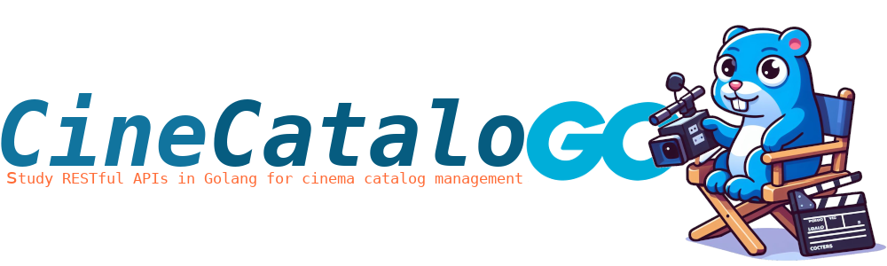
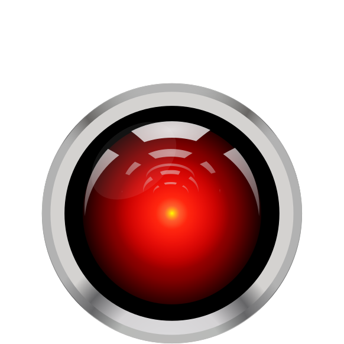
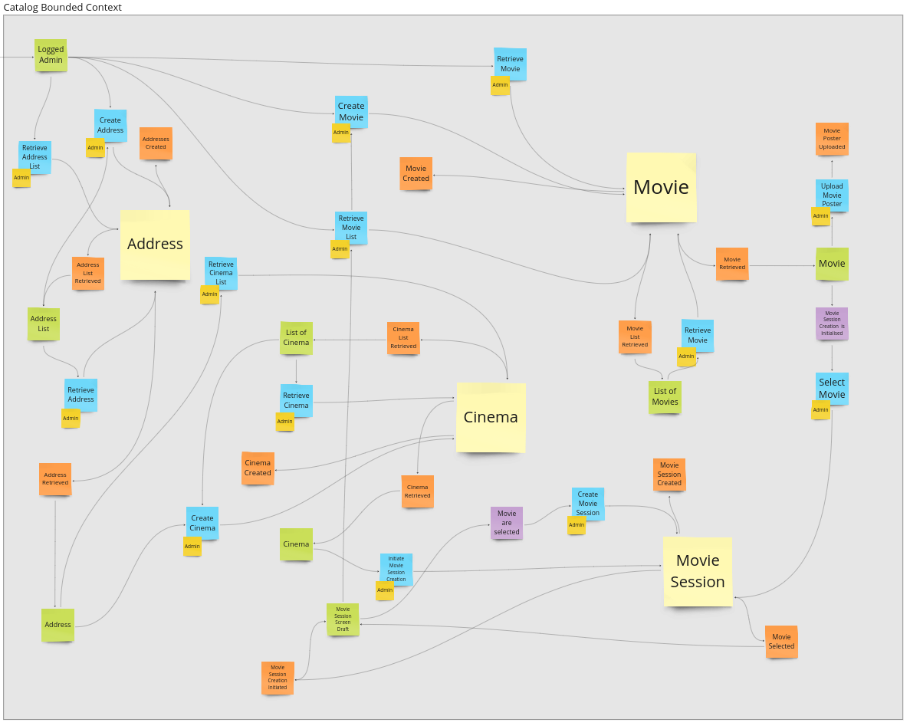
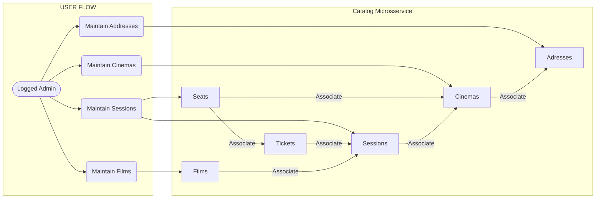
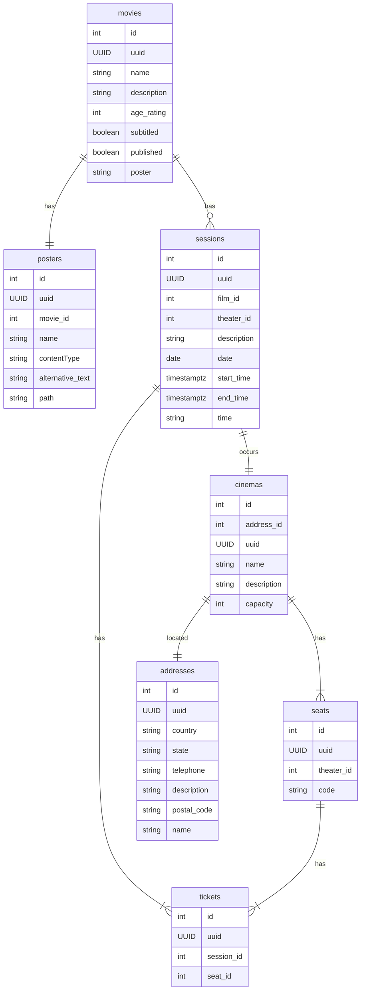

<a id="cine-catalogo"></a>
<!-- 
    Logo image generated by Bing IA: https://www.bing.com/images/create/
-->


<!-- 
    icons by: https://simpleicons.org
-->
[](https://go.dev/) [](https://www.docker.com/) [](https://ubuntu.com/) [](https://github.com/spf13/viper) [](https://github.com/jtonynet) [](https://miro.com/) [](https://mermaid.js.org/) [](https://code.visualstudio.com/) [](https://en.wikipedia.org/wiki/Hypertext_Application_Language) [](https://blog.postman.com/introducing-the-postman-vs-code-extension/) [](https://www.postgresql.org/)  [](https://swagger.io/) 

<!--
[](https://prometheus.io/) [](https://grafana.com/) [](https://www.jaegertracing.io/) [](https://www.jaegertracing.io/) [](https://redis.io/) [](https://www.keycloak.org/) [](https://gatling.io/) [](https://gatling.io/) [](https://ceph.io/en/) 
-->

 


 [](https://miro.com/app/board/uXjVNRofMoA=/) [](https://www.youtube.com/watch?v=6nEbm71Vc3w) [](https://github.com/users/jtonynet/projects/2)


 __This is an initial readme, here you can find the project's goals, and some features are not yet fully available. *__ 

<br/>

---

#### 🕸️ Found me in web:
[](https://www.linkedin.com/in/jos%C3%A9-r-99896a39/) [](https://dev.to/learningenuity) [](mailto:learningenuity@gmail.com) [](https://twitter.com/aromademirtilo) [](https://www.instagram.com/learningenuity) 


---


<a id="index"></a>
## :arrow_heading_up: index

[CineCatalog Microsservice](#cine-catalogo)<br/>
  1. :arrow_heading_up: [index](#arrow_heading_up-index)
  2. :green_book: [About](#about)
  3. :computer: [Run the project](#run)
  4. :traffic_light: [HATEOAS HAL](#HATEOAS)
  5. :umbrella: [Event Storming](#event-storming)
  6. :bar_chart: [Diagrams](#diagrams)
  7. :newspaper: [API Documentation](#api-docs)
  8. :toolbox: [Tools](#tools)
  9. :clap: [Best Practices](#best-practices)
  10. :brain: [ADR - Architecture Decision Records](#adr)
  11. :1234: [Versions](#versions)
  12. :robot: [Use of AI](#ia)

<br/>

[:arrow_heading_up: back to top](#index)

---

<a id="about"></a>
## 📗 About:

This project aims to address the needs of cataloging cinema halls, movies, and sessions on a cinema ticket e-commerce website. It is part of a broader study of the mentioned e-commerce called [CineTicket](https://github.com/jtonynet/cine-ticket-study-microsservices). However, its responsibility as microservices is to register, maintain, and provide session and seat data.

This is a Golang version of the mentioned service. Swagger Docs, Flow Diagrams, Entity-Relationship Diagrams (DER), and Event Storming provide more context to the service's scenario.

The objective of this system is to maintain a [high level of maturity](https://martinfowler.com/articles/richardsonMaturityModel.html) with a consistent RESTful API, along with the possibility of caching and a robust logging system.

<br/>

[:arrow_heading_up: back to top](#index)

---

<a id="run"></a>
## 💻 Run the project

Create a copy of the 'SAMPLE.env' file with the name '.env' and run the 'docker compose up' command (according to your 'docker compose' version) in the project's root directory:
```bash
$ docker compose up
```

<!-- 
> :writing_hand: **Note**:
>
> :window: Troubleshooting with [Windows](https://stackoverflow.com/questions/53165471/building-docker-images-on-windows-entrypoint-script-no-such-file-or-directory)
> Git attribute settings that might affect the line ending character are not working as expected. To run the project on Windows, you will need to make changes to the './tests/gatling/entrypoint.sh' file. Convert the file from 'LF' to 'CRLF' in your preferred text editor.
-->

<br/>

[:arrow_heading_up: back to top](#index)

---

<a id="HATEOAS"></a>
### 🚥 HATEOAS HAL

The API is being developed following RESTful guidelines at `maturity level 4` for educational purposes. Hal Explores can be used to navigate and validate consistency with the specification by simply accessing a [local tests URL](http://localhost:4200/#uri=http://localhost:8080/v1/) with the application running. See the [Hypertext Application Language](https://en.wikipedia.org/wiki/Hypertext_Application_Language) for more details .


<br/>

[:arrow_heading_up: back to top](#index)

---

<a id="event-storming"></a>
## ☔ Event Storming Diagram:

In November 2023, we conducted event modeling for this project and other parts of CineTicket (Thanx for the help, [marciovmartins](https://github.com/marciovmartins)). We held an extensive remote Event Storming session with the goal of mapping events, commands, aggregates, and their relationships.

You can follow part of our findings on [YouTube](https://www.youtube.com/watch?v=6nEbm71Vc3w) in PT-BR.


At the moment, we are abstracting the authentication flow and the ticket purchase flow.



<br/>

[:arrow_heading_up: back to top](#index)

---


<a id="diagrams"></a>
## 📊 System Diagrams:

**Flow Diagram:**


<br/><br/>

**DER:**



<br/>

[:arrow_heading_up: back to top](#index)

---
<a id="api-docs"></a>
## 📰  API Documentation

####   Generate Swagger docs:

With the 'cine-catalogo' image running, type:

```bash
$ docker exec -ti cine-catalogo swag init --generalInfo cmd/api/main.go --exclude ./web,./tools
```

<br/>

[:arrow_heading_up: back to top](#index)

---
<a id="tools"></a>
## 🧰 Tools

- Language:
  - [Go v1.21.1](https://go.dev/)
  - [GVM v1.0.22](https://github.com/moovweb/gvm)

- Framework & Libs:
  - [Gin](https://gin-gonic.com/)
  - [GORM](https://gorm.io/index.html)
  - [Viper](https://github.com/spf13/viper)
  - [Gin-Swagger](https://github.com/swaggo/gin-swagger)
  - [gjson](https://github.com/tidwall/gjson)
  - [uuid](github.com/google/uuid)
  - [go2hall](https://github.com/pmoule/go2hall)

- Infra & Technologies
  - [Docker v24.0.6](https://www.docker.com/)
  - [Docker compose v2.21.0](https://www.docker.com/)
  - [Postgres v16.0](https://www.postgresql.org/)
  - [Redis 6.2](https://redis.io/)
  - [Gatling v3.9.5](https://gatling.io/)


- GUIs:
  - [VsCode](https://code.visualstudio.com/)
  - [Postman](https://blog.postman.com/introducing-the-postman-vs-code-extension/)
  - [DBeaver](https://dbeaver.io/)
  - [Another Redis Desktop Manager](https://github.com/qishibo/AnotherRedisDesktopManager)


<br/>

[:arrow_heading_up: back to top](#index)

---

<a id="best-practices"></a>
## 👏 Best Practices

- [Conventional Commits](https://www.conventionalcommits.org/en/v1.0.0/)
- [keep a changelog](https://keepachangelog.com/en/1.0.0/)
- [ADR - Architecture Decision Records](https://cognitect.com/blog/2011/11/15/documenting-architecture-decisions)
- [Event Storming](https://en.wikipedia.org/wiki/Event_storming)
- [Miro Diagrams](https://miro.com/)
- [Mermaid Diagrams](https://mermaid.js.org)
- [Swagger](https://swagger.io/)
- [RESTful](https://restfulapi.net/)
- [HATEOAS](https://en.wikipedia.org/wiki/HATEOAS)
- [High Rest Maturity Model](https://martinfowler.com/articles/richardsonMaturityModel.html)

<!-- 
- [Load testing](https://en.wikipedia.org/wiki/Load_testing)
- [Go pprof](https://go.dev/blog/pprof)
-->

<br/>

[:arrow_heading_up: back to top](#index)

---

<a id="adr"></a>
## 🧠 ADR - Architecture Decision Records:

- [0001: Record architecture decisions](./docs/architecture/decisions/0001-record-architecture-decisions.md)
- [0002: Gin, Gorm and Postegres in two tier architecture](./docs/architecture/decisions/0002-gin-gorm-and-postgres-in-two-tier-architecture.md)

<br/>

[:arrow_heading_up: back to top](#index)

---

<a id="versions"></a>
## 🔢 Versions:

Version tags are being created manually as studies progress with notable improvements in the project. Each feature is developed on a separate branch, and when completed, a tag is generated and merged into the master branch.

For more information, please refer to the [Version History](./CHANGELOG.md)

<br/>

[:arrow_heading_up: back to top](#index)

---

<a id="ia"></a>
### 🤖 Use of AI:

The header figures on this page were created with the help of artificial intelligence and a minimum of retouching and construction in Gimp [](https://www.gimp.org/)

__The following prompts were used, in PT-BR, for creation in [Bing IA:](https://www.bing.com/images/create/)__


<details>
  <summary><b>Gopher Cinema Director</b></summary>
"Gopher simbolo da linguagem golang azul em cores cartoon chapadas como diretor de cinema, sentado em uma cadeira caracteristica, segurando uma camera e com uma claquete no chão"<b>(sic)</b>
</details>


<br/>

AI also helped in some research in this study by being used as a support tool; however, __arts and development are, above all, human creative activities. Value people!__

Hire artists for commercial or more elaborate projects and Learn Ingenuity!

[:arrow_heading_up: back to top](#index)


<!-- 
Request Validations in Go REST API:
  https://www.reddit.com/r/golang/comments/13npbzj/request_validations_in_go_rest_api/
  https://tutorialedge.net/golang/validating-http-json-requests/
  https://github.com/go-playground/validator

Golang-standards:
  https://github.com/golang-standards/project-layout/blob/master/README_ptBR.md

Claudson
  Bad Go Practices: https://www.youtube.com/watch?v=bRPpNaPZI6s
  Stripe: https://www.youtube.com/watch?v=bRPpNaPZI6s

Docker - Bind for 0.0.0.0:4000 failed: port is already allocated
  https://stackoverflow.com/questions/46176584/docker-bind-for-0-0-0-04000-failed-port-is-already-allocated

HATEOAS:
  https://github.com/toedter/hal-explorer
  https://en.wikipedia.org/wiki/Hypertext_Application_Language

HTTP API Best Practice:
  https://www.rfc-editor.org/rfc/rfc7807

CORS GIN
  https://stackoverflow.com/questions/29418478/go-gin-framework-cors

Fix #216: Enable to call binding multiple times in some formats
  https://github.com/gin-gonic/gin/pull/1341

GO Design Patterns
  https://dev.to/kittipat1413/understanding-the-options-pattern-in-go-390c

Multiple files
  https://gin-gonic.com/docs/examples/upload-file/multiple-file/
  https://stackoverflow.com/questions/64873546/how-to-upload-multipart-file-and-json-in-go-with-gin-gonic


  https://github.com/domaindrivendev/Swashbuckle.AspNetCore/issues/846

  https://swagger.io/docs/specification/data-models/oneof-anyof-allof-not/

  https://github.com/Dwolla/hal-forms#form-transcoding

  https://swagger.io/docs/specification/data-models/inheritance-and-polymorphism/

  https://github.com/swaggo/swag/blob/master/example/basic/api/api.go

-->
